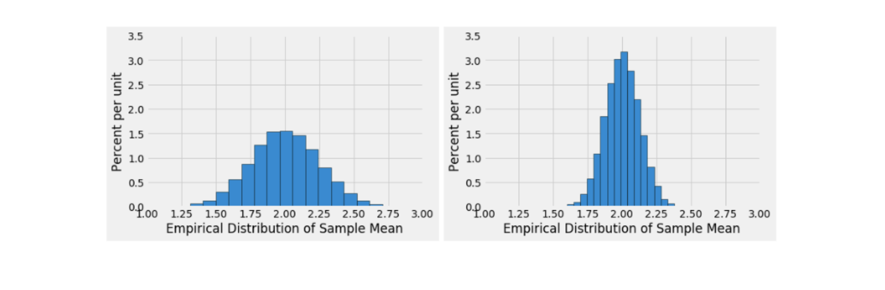

#### D8 Sample Means and CLT Disc10 
## Sample Means and CLT 
#### Sean Villegas

Observe: 
1. When large samples are drawn `with_replacement=True`, and the data is directly from the population; the result will be an **empirical distribution** of the _sample mean_ **centered** around the **population mean**
2. When you have a single sample, you use the **sample mean** and **standard deviation** to replace the **populations mean** and **standard deviation**
3. If you `Bootstrap` (resample from one representative sample) and get the empirical distribution of sample means **THEN** it will be roughly centered around the **original samples mean** ---
    - It will not be centered around the **population mean**
    - **HOWEVER** if the sample size gets larger, your original samples mean will be a more accurate representation of the population mean
4. In Both of the above situations, (resampling directly from population or bootstrapping from single representative sample of data):
    - **the Central Limit Theorem Applies (granted the conditions are met)**

Vocab: 
- **Empirical Distribution:** is when we have data that lets us take observations, so a finite number that we test with
    - **CLT** lets us make the **Empirical Distribution** look like the **Probability Distribution**
    - It is obtained by repeatedly resampling and calculating the statistic for those resamples (i.e. bootstrap)
- **Standard Deviation** is the **spread** of the distribution of sample means
    - a measure of the spread or variability of a distribution, including the distribution of sample means, also known as the standard error of the mean

Notes: 
- So FAR, you have used bootstrap to estimate **parameters** of **population** (e.g. median and mean)
- You can use empirical distributions for these sample statistics 
    - It is obtained by repeatedly resampling and calculating the statistic for those resamples (i.e. bootstrap)
- The **Central Limit Theorem** tells us **more** about the distribution of sample mean. If you draw a **large random sample with replacement** from a population --> regardless of distribution of population the **probability distribution** for that **samples mean** is roughly normal, centered at population mean
    - In laymans terms, the **CLT** let us use data that is not uniform (bell-shaped). E.g. the data can be skewed left/right side  


### "Regardless of Distribution of Population" in this context
- Even if the population you're sampling from is not normally distributed — it could be skewed, bimodal, uniform, or even weirdly shaped — the distribution of the sample mean will still be approximately normal if:
    - You take a large enough sample, and
    - You repeat that sampling process many times.
- The **CLT** is what lets us use normal distribution techniques (like confidence intervals and hypothesis testing) even when our original data isn't normal. _That’s why it's such a powerful tool in statistics._

<center> Standard Deviation of distribution of all sample means" <=> "sample mean standard deviation"</center>


# Questions

1. Cyrus takes many large random samples with replacement from the population with the goal of generating an empirical distribution of the sample mean. What shape do you expect this distribution to have? Which
value will it be centered around?
    - **Answer**: I predict that the shape of the empirical distribution of the sample mean will be bell shaped (normal distribution) and centered around the distribution sample mean 
2. Why are we able to use the CLT to reason about the empirical distribution of the sample mean’s shape if the
population data is skewed?
    - **Answer**: By the CLT and with a large sample size, we can take many samples, with replacement regardless of the skew representation (i.e. distribution of population)
3. Suppose that Cyrus creates two empirical distributions of sample means, with different sample sizes. Which distribution corresponds to a larger sample size? Why?

    - **Answer**: The distribution that corresponds to the larger sample size is the one on the right. As we increase the sample size, the empirical distribution data becomes more narrow and taller. 
        - Therefore becoming a more accurate representation of the Probability Distribution by CLT Method and Law of Averages 
4. Based solely on the information in the histogram, what is an estimate for the standard deviation of the sample mean on the left? How did you determine this?
- The estimate for the standard deviation of the left sample mean is 2.00 just as it is in the right graph, the only difference is graph 1 distribution is wider. This question focuses on the spread of the graphs rather than mean 
    - In laymans terms, it is more spread out
    - According to the Central Limit Theorem, a smaller sample size leads to a larger standard deviation of the sample mean, which results in a wider distribution.

5. Suppose you were told that the distribution on the right was generated based on a sample size of 100 and has a standard deviation of 0.2. How big of a sample size would you need if you wanted the standard deviation of the distribution of sample means to be 10 times smaller?

Given: 
- Sample size: 100 
- Standard deviation of sample mean: 0.2 
- Goal: Reduce standard deviation of sample mean by a factor of 10 (i.e., make it 0.02)

Task:
1. In order to reduce the standard deviation in sample mean by `x`, you must increase `x` sample size by **x<sup>2</sup>**

Equation: 
- `New standard deviation of the sample mean` = 0.2/10<sup>2</sup>
- The sample size would need to be 10000 if you wanted the standard deviation of the distribution of sample means to be 10 times smaller

6. Constructing a confidence interval for the mean number of hours students spend in Main Stacks each year. To do this, you take a random
sample of 400 UC Berkeley students and record how many hours each student spent studying in Main Stacks over the past year. Then, you compute the mean number of hours for your sample; it is 170 hours. You also calculate the standard deviation of your sample to be 10 hours.
    
- Mia claims that the distribution of all possible sample means is normal with an SD of 0.5 hours. Use this information to construct an approximate 68% confidence interval for the mean hours spent studying in MainStacks for all UC Berkeley students.

    Given: 
    - Sample Size: 400
    - Mean: 170 
    - Standard Deviation of Sample: 10
    - Distribution of all possible means is normal with an Standard Deviation 0.5 

Formula: 

`mean ± 1 x Standard Deviation of Sample Mean`
 
`170 - 1 x 0.5 = 169.5` & `170 + 1 x 0.5 = 170.5`
- The `± 1` comes from the fact that 68% of the data under a normal distribution is within 1 standard deviation from the mean.
    -  When dealing with sample means, you use the standard error (SE) instead of the population standard deviation, but the principle remains the same.

- If Mia had not told you what the SD of the distribution of sample means was, could you estimate it from the data in the sample? If yes, how?
    - Yes, we can use the Standard Deviation of Sample Mean formula 
`Standard Deviation of all Sample Means = Sample Standard Deviation / √Sample Size`

```python
import math

sample_standard_deviation = 10 

square_root = math.sqrt(400)

sd_of_all_sample_means = sample_standard_deviation/square_root 
# answer is 0.5 
```

7.  You are a super fan of the girl group TLC and are interested in estimating the average amount of plays their songs have online. You generate an 80% confidence interval for this parameter to be [700000, 1200000] based on a random sample of 50 songs using the Central Limit Theorem. Are each of the following statements true or false? (Fun Fact: Generally, n ≥30 is considered the minimum sample size for CLT to take effect!)

    a. The value of our population parameter changes depending on our sampling process.

        False; the **population parameter** does not change. It is a **static** number that represents our population before we are sampling. Only thing that changes is the estimations of this population parameter

    b. The empirical distribution of any statistic we choose will be roughly normal based on the Central Limit Theorem, but it requires our population to have a normal distribution to begin with.

        False; the first statement is true, but the second one is not. You do **NOT** need a normal distribution to begin with. Just a large enough sample size and a large re-sampling 

    c. If we generate a 95% confidence interval using the same sample, the interval will be narrower than the original confidence interval because we are more certain of our results.

        False; as you increase the Confidence Interval, you need a higher (wider) confidence to capture the variability of the population parameter

    d. Using the same process to generate another 80% confidence interval, there is an 80% chance that the next confidence interval you generate will contain the true average number of plays for TLC songs.

        False; this Confidence Interval can only capture variability within 80% wide. The 80% refers to the long-run proportion of intervals that would contain the true parameter if we repeated the sampling process many times

    e. There is an 80% chance that a confidence interval we generated contains the true average number of plays for TLC songs.

        False; The 80% confidence interval means that if we repeated the sampling process many times, 80% of the intervals we generate would contain the true population parameter. For any single interval, the true parameter is either inside it or not (e.g. it doesn't have a probability.)


    f. 80% of TLC’s songs have between 700,000 and 1,200,000 plays.
        
        False; the 80% Confidence Interval is finding the true population parameter (in this case, it is the average number of plays)

    g. The original sample mean you obtained was approximately 950,000 plays.

        True; this question is asking you to take the mean and verify the number given

        Mean = Parameter1 + Parameter2/ 2 = 950,000 <=> **Sample Mean** 