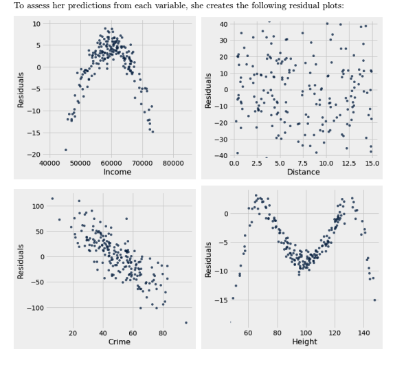

#### D8 Sp 25
# Regression Inference, Residuals, and Classification 
#### Sean Villegas

<style>
.tnr {
  font-family: 'Times New Roman', serif;
  font-size: 18px;
}

</style>

#

## Vocab 

**Standard Units:**
-  When you standardize x and y you're subtracting the mean of each variable and dividing by their standard deviations, which transforms x and y to have mean 0 and standard deviation 1

**Correlation Coefficient (i.e. _r_)**
- This is why we compute the product of the standardized variables. The correlation coefficient between the standardized variables is given by a formula.
- You take the mean when you're calculating the correlation coefficient because you are looking at why x and y move together. Specifically, you want to understand the average behavior of x and y relative to their means. The product will be in units that are easier to interpret 
- TLDR: 
    - _r_ is unitless or "standardized," meaning that it doesn't have any units $\Rightarrow$ it must be converted to standard units so you can compute r 

## Regression Inference 
<div class="tnr">

You take a sample of D8 students and ask them about their daily consumption of coffee and their midterm exam score. Assume you are given a table `students` with the columns `cups` and `score`. The column `cups` contains daily consumption of coffee and `score` contains midterm exam score for each student from the sample. You perform linear regression and find a slope of 0.13 points per cup of coffee. Katy is considering buying coffee for her discussion to increase their scores but is not sure if this will work. 

**Question 1.1.** 

State a null and alternative hypothesis to see whether this slope was due to randomness in your sample
</div>

**Answer** 

Null hypothesis: 
- The true slope of the population is at 0

Alternative hypothesis: 
- The true slope of the population is not at 0


<div class="tnr">

**Question 1.2**

Write a func `slope` that takes in a table, and returns the slope of the least-squares line using the first column to predict values of the second column 
</div>

```python
# skeleton 

def slope(tbl):
    x = tbl.column(0)
    y = tbl.column(1)
    x_su = (x - np.mean(x)) / np.std(x) 
    y_su = (y - np.mean(y)) / np.std(y)
    r = np.mean(x_su * y_su) 
    slope = r * np.std(x_su) / np.std(y_su) # why do we use r * np.std(x) / np.std(y) instead?
    return slope 

# answer 
def slope(tbl):
    x = tbl.column(0)
    y = tbl.column(1)
    x_su = (x - np.mean(x)) / np.std(x) 
    y_su = (y - np.mean(y)) / np.std(y)
    r = np.mean(x_su * y_su) 
    slope = r * np.std(x_su) / np.std(y_su) # why do we use r * np.std(x) / np.std(y) instead?
    return slope 
```

### Where I went wrong
1. I need to memorize standard units formula
2. You do not take the standard deviation of standard units but instead of the original units array 
    ```python
    slope = r * np.std(x) / np.std(y)  # Use the original std deviations of x and y
    ```
### Where I went right
1. Understood that we have a table with columns x and y that we want to perform analysis on, but we do not know the column name $\Rightarrow$ use indexing
2. When calculating the correlation coefficient you take the mean once, of the product of multiplying $\text{x}_{su}$ and $\text{y}_{su}$ together 

### Hindsight 
- **Standard units** makes the correlation _r_ easier to compute and interpret because it removes the units and makes the data comparable.
- Using the **original standard deviations** in the slope formula (i.e. not taking the std of the standardized units) allows the regression line to return a slope that is **meaningful in the original units of the data** (e.g., cm for height, kg for weight).

#


<div class="tnr">

**Question 1.3**

Complete the code to generate 5000 bootstrap resample slopes and then calculate a 95% confidence interval for the slope. Assume the function `slope(tbl)` has been implemented right

</div>

```python
# skeleton 

slopes = ______
for i in ______: 
    resample_slope = ______
    slopes = ______
left_end = ______
right_end = ______
interval = ______

# answer 

slopes = make_array() 
for i in np.arange(5000):
    resample_slope = slope(tbl.sample()) # needed to pass in the table name
    slopes = np.append(slopes, resample_slope)
left_end = percentile(2.75, slopes) # supposed to be 2.5 as the percentile  
right_end = percentile(97.5, slopes)
interval = [left_end, right_end]
```

### Where I went wrong
- I forgot that you need to pass in the table, in this case it is `students`
- $\text{97.5 - 100 = 2.5}$, not 2.75 

### Where I went right
- Correctly identified that we needed to have a bootstrap resampling; which includes: 
    - `make_array`
    - `np.array(rep)`
    - `np.append(sample_array, data)`
    - `percentile(num, data)`
    - `interval` list of Confidence Intervals

### Hindsight 20/20 
- This is a bootstrapping process to analyze slope variability 

#

<div class="tnr">

**Question 1.4**
Suppose you find the confidence interval [0.02, 0.24]. What do you conclude about your hypothesis at p-value cutoff of 5%? What about at a p-value cutoff of 10%? What about a p-value cutoff of 1%? 
</div>

**Answer** 
- We can conclude that the true slope of the population is not at 0 because we do not have the value 0 as either left percentile or right percentile at 5%, meaning we reject the null with our 95% confidence interval 
- A p-value cutoff of 10% would make us have a confidence interval of 90%, which would allow us to assume that 0 would not be in 90% of the data and reject the null
- A p-value cutoff of 1% would shrink our confidence interval to be smaller, meaning that we could possibly capture a 0 in our intervals and thus we would most likely accept the null hypothesis 

**Textbook answer** 
- At the 5% cutoff (95% CI), we reject the null hypothesis because 0 is not in [0.02, 0.24].
- At the 10% cutoff (90% CI), the interval would be narrower, so 0 would still not be included. We still reject the null at 10%.
- At the 1% cutoff (99% CI), the interval would be wider, and 0 might be included. We might not have enough evidence to reject the null at 1%.

### Where I went wrong 
- My understanding of the confidence interval visuals is wrong
- i.e. when we have a 1% cutoff, our interval would be wider, at 10%, it would be narrower (i.e. it shrinks it). 1% would be the widest interval 

### Where I went right
- I correctly rejected and accepted the null at appropriate questions. 

#

<div class="tnr">

**Question 1.5** 
Your friend who has not taken D8 looks at your result and asks you what the confidence interval means. Which one of the following is a correct response? 

1. For 95% of students, there is a relationship between coffee consumption and midterm score
2. There is a 95% probability that the true slope is between 0.02 and 0.24 
3. There is a 95% probability that our sampling process (and code above) will produce an interval that contains the true slope 

</div>

**Answer** 
3. There is a 95% probability that our sampling process (and code above) will produce an interval that contains the true slope 

### Where I went wrong
- For option 1 correlation does not imply causation, and I believe thats why the first option is wrong

### Where I went right
 - This is false, there is no probability, the true slope either _is_ or _isnt_ in the interval that we computed

### Hindsight 20/20 
- Option 3 is correct because it's about the **method** producing an interval that contains the true value 95% of the time.
- For option 1 understand the problem set specifics of what we are trying to answer. **Confidence intervals are always about estimating some unknown population parameter. The parameter could be anything — slope, mean, proportion, etc., depending on what you're studying.**
    - This Confidence interval is about the slope (a parameter for the population), not about individuals like "95% of students, due to the fact that we are testing the linear regression of a slope
    - Confidence intervals say something about the relationship overall, not about what happens to each student.


## Residuals 
<div class="tnr">

TLDR: 
1. Datascience employs **linear regression** to make predictions. 
2. To assess accuracy of predictions we examine the error between our actual data and the predictions
    - _Definition of **residuals**_
3. $\text{Residual = actual value of y - estimated value of y}$
4. The mean of residuals are _(about)_ 0, and they show no trend (i.e. the correlation is zero with x)
    - Also zero correlation with fitted values, because that's a property of least squares regression.
        - **Reasoning:** It's more about how the least squares regression line is calculated. Mathematically it guarantees that the residuals are uncorrelated with both $\text{x}_{observed}$ and $\text{y}_{predicted}$

5. If our residual plot shows a pattern, then it is a good indication that linear regression was not a good fit for this model
    - i.e. another model such as parabola, exponential, or logarithmic models
6. A residual is positive when we underestimate (the prediction is too low)
    - i.e. it is above the `x-axis`
7. A residual is negative when we overestimate (the prediction is too high)
    - i.e. it is below the `x-axis`
</div>

#

## Sp2022 Final 
<div class="tnr">

Suppose Kimiko tries to predict the emergency response time of superheros from each of the following four different variables: 

- Income (float): the average income in the emergency locations neighborhood 
- Distance (float): the distance in miles from emergency location to their headquarters
- Crimes (float): the average weekly number of crimes reported in the emergency locations neighborhood last year
- Height (float): the average building height (in feet) in the emergency locations neighborhood. 



**Questions:**
1. Which of the plots above indicate that the variable is linearly associated with response time?
2. Kimiko suspects she may have made a mistake in her code when plotting the residuals. Which of the plots above are impossible residual plots?
3. For which of the above plots should Kimiko try a quadratic equation for regression?

**Options:**
- Income
- Distance
- Crimes
- Height
- None of the above 
</div>

**Answers**

1. Plot 2, Distance 
2. Height, Crime, and Income are impossible 
3. Income plot (parabola $\Rightarrow$ quadratic )

**Observations** 
_draw a line at 0 on the y axis, as thats what residual plots should be centered about_ 
1. Plot 1 is a parabola, there should be no relationship forming. When we center the y axis at 0, we can see the the negative values indicate we are overfitting and the variables at the top are underfitted 
2. Plot 2 is the best plot out of all of them, because there is no relationship, as there should be (definition of Residual i.e. zero correlation between fitted values) 
3. Plot 3 we can see under fitted values in the positive y axis and overfitted in the negative axis. We also see a linear relationship that is going down negative, and we shouldn't see a relationship on fitted values
4. PLot 4 is something we would rarely see. The middle of the values are overfitted at the negative axis and the positive axis has underfitted points. About 0, we can see a disproportionate amount of points compared to the other. We should see randomly scattered plots that appear symmetric to a degree, without showing a relationship 

#

## Train/Test Split

<div class="tnr">

**Definition** 
Classification is used to make predictions based on existing data. Questions we can answer: 
1. Is person A going to vote for a certain politician?
2. Is a certain purchase an instance of credit card fraud? 
3. Do I have a certain disease? 

_Observations_: existing individuals in a population that you have data on

_Attributes_: characteristics of individuals that you will build the classifier for. In Data8, attributes are binary (yes no, 1 0)

_Population_: a larger group of individuals, who you do not know the attributes for. A classifier is built in order to predict the attributes of those in the population 

**Training and Testing Data**
1. The reason why we made a classifier is so we can make predictions on new data from our **underlying population**.
2. How do we know if our classifier makes accurate predictions? 
    - We split dataset into two random sets; **training** and **testing** data to validate classifier accuracy 
    - **Typical split is 80/20** 
    - **IMPORTANT:** We look at the testing data _after_ we finished training classifier 

```sql
        All Data
           |
   -------------------
   |                 |
Test Data        Train Data
   |                  |
   |             Train Model
   |                  |
   |            Make Predictions
   |                  |
Collect Errors   <-----
```

- If you include test data in training data for model, you will run into overfitting the model 

**Discussion Questions:**

**3.1** In order to make the model as accurate as possible, should we use all of our data to train the model? 

**Answer:**
No, we still need to have the testing portion of the data to test our model against. A good portion of our data should be trained though. 

**3.2** How should we split our data into training and testing sets? (i.e. how do we decide which rows go to which set?) Why? 

**Answer:**
We split our data randomly into training and testing sets. However, rule of thumb is 80% training and 20% to test model against. 


**3.3** How about using 10% of the data for training, and 90% for testing? 

**Answer:**
Lowering our testing data will make our model not account for the extra 10% variability in our testing data. In other words the model will be a weaker underfitted model based on 90% of the data it sees. It wont learn meaningful patterns. 

**Textbook:**
- With only 10% for training, the model doesn’t learn enough patterns.
- **Overfitting** happens when a model is too complex and memorizes the training set — but here you have too little training data to even memorize!
- **Key Ideas:**
    - Overfitting = too much memorization (too little testing, too complex model)
    - Underfitting = too simple model, too little training data to learn properly


</div>


