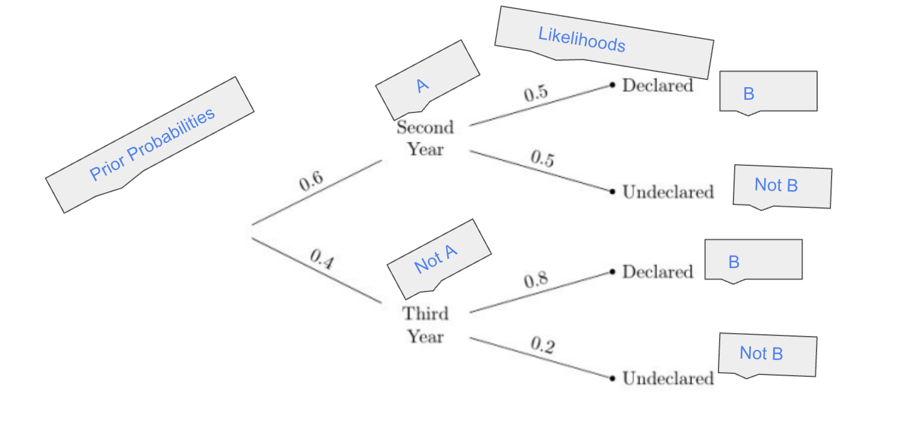
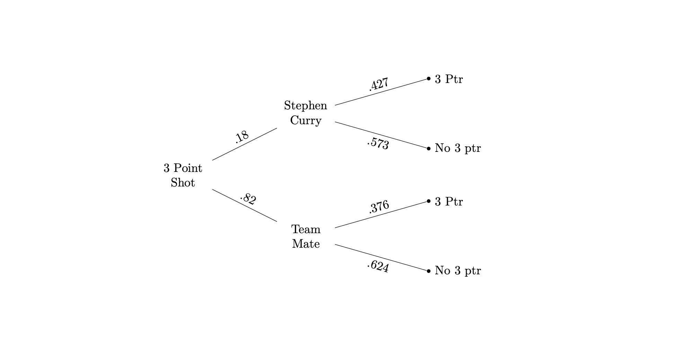
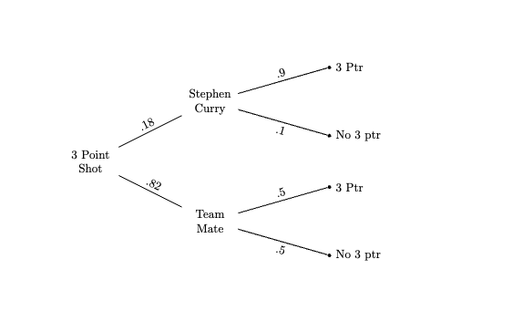
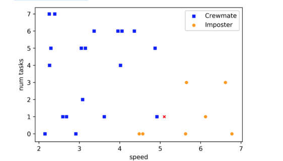

#### D8 Sp25
# Classification, Bayes Rule
#### Sean Villegas


[Ch18](https://inferentialthinking.com/chapters/18/2/Making_Decisions.html)


<style>
    .tnr {
        font-family: 'Times-New-Roman';
        font-size: 16px;
    }
</style>

## Classification 

<div class='tnr'>

**1.1** Thomas and Ramisha are deciding on which kind of nearest neighbors classifier they want to use. Ramisha says that using larger numbers of neighbors will always result in more accurate predictions. Thomas disagrees. Who is right, why? 
</div>

- Ramisha is incorrect. Using larger numbers of neighbors doesn't always improve accuracy. While considering more neighbors can reduce overfitting and smooth out noise, using too many can cause the classifier to become too generalized, ignoring useful local patterns in the data. This tradeoff means there's often an optimal value of k that balances bias and variance. Thomas is more correct because the best k depends on the structure of the data. Thats why we split the data in half for classification (i.e. train and test)
    - In your current kNN classification exercise, if you did a 50/50 split, that's okay for learning — but if you were optimizing performance in a real model, you'd likely use 80/20.


<div class='tnr'>

**1.2** Thomas instead proposes they use k = 1 nearest neighbor instead because he dislikes large k. What is a potential issue with this approach?

_Hint: Think about the case where we have to groups, label A and label B, completely separated from each other, except for 1 label A point on graph that lies in the B region_
</div>

- Choosing k = 1 can raise an issue of have too little data. We are considering less neighbors and therefore underfitting the model if a point A on the graph was close to the B region of split data, meaning the model would classify point A as B because of that. If it had a larger k, it would be able to learn and determine that A is related to the group A. 

**Refined answer:**
- Choosing k = 1 can lead to overfitting, because the model becomes too sensitive to noise or outliers in the training data. For example, if there’s a single point from class A that accidentally ends up in a region dominated by class B, a 1-nearest neighbor classifier will misclassify nearby points based on just that one outlier. A larger k helps smooth out such irregularities by considering more surrounding data points, which leads to better generalization.

## Decision Boundaries 

<div class='tnr'>

A student is trying to build a classifier that classifies Berkeley students as residents of Northside or Southside. The student has a random sample of Berkeley students all whom live on Northside or Southside. For each student she records whether the students lives on Northside or Southside, the number of times the student went to La Vals (on Northside) in the last 6 months, and the number of times the student went to Gypsys (on Southside) in the last 6 months.

**2.1** Draw a decision boundary for a 5 nearest neighbor classifier on the scatter plot below

1. For this exercise, you pick 5 on the number line and draw a curved, nonlinear shapes that creates a separated group for Southside points and Northside points
    - complex models would introduce a hill shape to grab each value that is miss-classified 
2. Outliers (errors) are okay in this model because k=5


**Refined answer:**
- A k = 5 nearest neighbor classifier draws decision boundaries based on local majority vote among the 5 nearest neighbors to a given point.
- The boundary lies along the region where there’s a tie or shift in majority between Northside and Southside neighbors. You would draw it between clusters of points that tend to go more often to one restaurant over the other.
- Outliers have less influence when k is larger, like k = 5, because one noisy point is unlikely to shift the majority vote among five.
    - Therefore, some misclassifications near the boundary are expected, but the classifier still performs reasonably well by smoothing over those with the majority vote.
</div>

## Bayes Probability


<div class='tnr'>

- The vertical bar in P(B | A) is a condition, _probability of B, given A occured_ 
- Before doing Bayes rule problems, draw tree diagram 
- Formula: $P(A | B) = \frac{P(A \: \text{and} \: B)}{P(B)} = \frac{P(A) * P(B|A)}{P(B)}$
    - Allows us to answer questions, given new data, how can we update chances we found earlier? 
    - To solve with Bayes rule for **Posterior Probability** of an event we need the **Prior Probability** and **Likelihood** of associated events
- In the formula above, were trying to solve for **Posterior Probability P** (A | B) where our prior probability is P(A) and our **Likelihood** is P(B | A) 
- It matters what order you align probability statements
- You square the computed probability if it occurs again

**E.g.**
- **Posterior Probability** is the updated probability of a hypothesis (like "Steph took the shot") after observing evidence (like "a 3-point shot was made").
- **Likelihood** is the probability of the evidence given the hypothesis (like "probability of making a shot, given it was Steph").

$$\text{Posterior Probability} = \displaystyle\frac{Prior * Likelihood}{\text{Total Probability of Evidence}} $$

#

**Problem Set:** During the 2022-2023 NBA regular season, the Golden State Warriors took a total of 3,540 3-point shots. 18% of those were shot by the Warriors star point guard Steph Curry, and the rest were shot by his teammates. During that season Steph hit 42.7% of all the 3-point shots he took, while his teammates only made 37.6% of theirs. You may assume that each shot is independent and they do not affect each other.

**3.1** Draw associated tree diagram for the problem

**3.2** What is the probability that any given 3-point shot taken by Warriors was taken by Steph Curry in 2022-2023 season? 

**3.3** What is the probability that two random 3-point shots from that season are made if we do not know who shot it on the Warriors? 

**3.4** Josh was watching a warriors game last season when he walked away to talk to a friend. When he got back to his seat his friend told him the Warriors had made a 3-point shot. What is the probability that the 3-point shot was made by Steph Curry? 

**3.5** Angus was watching highlights of a recent warriors game and was told that in highlights, Steph Curry makes 90% of his 3 point shots and the rest of the team makes 50% of their 3-point shots. Given that a shot was made, what was the probability the highlight was from one of Steph Curry's shots? You may assume that the prior probabilities stay the same. 

</div>

<details>
<summary>Answers</summary>

**3.1** 



**3.2**

There is only one  possibility of the 3-point shots being Stephen curry, which is 0.18. 

**3.3**

1. There are two possibilities of a 3-point shot being made if we do not know who shot it.
2. Simply add the probabilities to find the total probability, and then square it to account for the second shot

$$\text{P(SC | MADE) P(MADE | SC) + P(TM | MADE) P(MADE | TM)}$$

$$\rightarrow .18(.427) + .82(.376) = 0.38518\rightarrow (0.38518)^{2} = 0.14836$$


**3.4** 
The probability of a 3 point shot being made by Stephen Curry is 

**Step 1:**

- Problem Set up 
- Find Probability of Stephen Curry making 3 ptr

$$P(A | B) = \displaystyle\frac{P(A \cap B)}{P(B)} $$

$$P\text{(Stephen Curry | Made)} = \displaystyle\frac{P(SC \cap Made)}{P(Made)} $$

$$\rightarrow P(.18 * .427) = 0.07686$$


**Step 2:**

- Find total probability of a 3 ptr shot being made $P(Made)$
- Means you also solve for a Team Mate making the shot

$$P(Made) = \text{0.07686 + (.82 * .376) = 0.38518} $$

**Step 3:**
- Apply Bayes rule (i.e. divide the probability of SC making a 3ptr by the whole probability of Warriors making a 3 ptr)

$$P\text{(Stephen Curry | Made)} = \displaystyle\frac{0.07686}{0.38518} = 0.1995$$

**3.5**
- This problem gives you new probabilities of making a 3 ptr for Stephen Curry and the Team mate. 
- Apply Bayes Probability Formula again based on new probabilities (draw new tree)



$$\text{New Probabilities: } P\text{(Stephen Curry | Made)} = \displaystyle\frac{P(SC \cap Made)}{P(Made)} $$

$$\text{New Probabilities: } P\text{(Stephen Curry | Made)} = \displaystyle\frac{.18 * .9}{(.18 * .9) + (.82 * .5)} $$

$$\rightarrow \displaystyle\frac{0.162}{0.572} = 0.2833$$

</details>


## Fall 2020 Final Question 4
<div class='tnr'>

Rick and Morty have been aboard a spaceship for 3 weeks among a crew of 100 people. Rick learns that there is an imposter among them, trying to sabotage their mission. Rick remembers that other space missions recently have had imposters sabotaging their crew. He thinks he might be able to make some predictions about his mission based on how those other missions concluded.

Rick samples flight logs of 26 crew members from across various missions in the last year and notes down a couple attributes about each sampled person, including the following:

- speed: (float) how fast they can run in zero-gravity
- num tasks: (int) how many tasks they completed by Week 3 of their mission
- outcome: (string) whether they ended up being an Imposter or an innocent Crewmate

Rick is suspicious of Morty’s sister, Beth, so he visualizes this sample data along with Beth’s attributes (the red X) in the following chart:



Suppose Rick now wants to use a k-nearest neighbor classifier to predict whether Beth is an imposter based on just her speed and num tasks.

**4.1** Which of the following values of k would be appropriate for Rick to use for his classifier? Select all that are correct:
- 1
- 2
- 4
- 7
- 10 
- 29 

**4.2** If Rick uses k=3 for his classifier, what will his prediction for Beth be? If Rick uses k=5 for his classifier, what will his prediction for Beth be?

- Imposter
- Crewmater

**4.3** Rick now decides to try his classifier on Morty. Suppose Morty has a speed of 5.2 and num tasks of 4. The closest neighbor to Morty in the training set has a speed of 5.6 and num tasks of 3.

```python
# Option 1
np.sqrt((5.2-5.6)**2 + (4-3)**2)
# Option 2
np.sqrt((5.2-4)**2 + (5.6-3)**2)
# Option 3
np.sqrt(abs(5.2-5.6) + abs(4-3))
# Option 4
(abs(5.2-5.6) + abs(4-3))/2
# Option 5 
np.sqrt(((5.2-5.6)**2 + (4-3)**2)/2)
```

**4.4** Morty is suspicious of Rick’s classifier and decides to create his own classifier. He conducts a random sample of 100 crew members from various space missions in the past year, observing the same attributes like speed and num tasks. Before using his classifier to make predictions, Morty would like to estimate its accuracy.

Which of the following are appropriate ways to do this? Select all that are correct:

- Train the classifier on all 100 crew members in the sample, use the classifier to predict the outcome of each of the 100 members, and measure how often the classifier is correct.
- Train the classifier on 55 randomly selected crew members from the sample, use the classifier to predict the outcome of each of the remaining 45 members, and measure how often the classifier is correct.
- Train the classifier on 70 randomly selected crew members from the sample, use the classifier to predict the outcome of each of the remaining 30 members, and measure how often the classifier is correct.
- Train the classifier on all 100 crew members in the sample, use the classifier to predict the outcome of 50 randomly selected members in the sample, and measure how often the classifier is correct.
- Train the classifier on all 100 crew members in the sample, use the classifier to predict the outcome of just the imposters in the sample, and measure how often the classifier is correct.

**4.5** Morty is worried that his classifier is going to perform very well on his training set but won’t be very accurate when making predictions on new crew members in the population. What is the name of this phenomenon?

1. Overfitting
2. Underfitting
3. Overprediction
4. Bayes Condition
5. Chebyshev’s Paradox


**4.6** Suppose Morty would instead like to predict a crew member’s num tasks based on their speed. Which of the following charts would be most appropriate to visualize the relationship between these variables?

- Scatterplot
- Pivot Table
- Histogram
- Line Graph
- Bar Chart

**4.7** Suppose Morty wants to predict a crew member’s speed based on their num tasks. Which of the following could be used to answer this question? Select all that are correct:

- Linear Regression
- Total Variation Distance
- Central Limit Theorem
- Classification
- A/B Testing
</div>


<details><summary>Answers & Logic</summary>

_draw a diagonal line from the point 3 that is curved to separate the two groups_ 

**4.1** The only appropriate values for Rick to use for his classifier are ones that: 
1. Are odd (so there is a majority vote instead of tie breakers)
2. Numbers that encompass the data (i.e. 10 and 29 are too large for the current dataset)

Thus the only correct options would be 1, and 7. 

- 1 works because it only cares about the x points single closest neighbor. It captures local patterns well but can be noisy if that one neighbor is an outlier from the separated groups.
- 7 gives a more balanced and stable estimate. It's still small enough to reflect the local cluster, but large enough to smooth out noise
    - With k = 7, you would consider the 7 closest points to Beth.


**4.2** `k=3` for classifier and `k=5` for classifier 
_literally look at the graph and see which points are closer based on the number and seperated groups, counting a vote. Classifier handles Euclidean Distance_
1. k=3 will classify Beth as an imposter, and so would k=5

**4.3** Rick now decides to try his classifier on Morty. Suppose Morty has a speed of 5.2 and num tasks of 4. The closest neighbor to Morty in the training set has a speed of 5.6 and num tasks of 3.

```python
# euclidean distance formula

# errors are arrays of points on graph 
np.sqrt(np.sum(np.square(error1 - error2)))

# equivalent to
np.sqrt((x1 - x2)**2 + (y1 - y2)**2)

# Option 1 # CORRECTO 
np.sqrt((5.2-5.6)**2 + (4-3)**2) 
# Option 2 # EQUIVACADO 
np.sqrt((5.2-4)**2 + (5.6-3)**2)
# Option 3 # EQUIVACADO 
np.sqrt(abs(5.2-5.6) + abs(4-3))
# Option 4 # EQUIVACADO 
(abs(5.2-5.6) + abs(4-3))/2
# Option 5 # EQUIVACADO 
np.sqrt(((5.2-5.6)**2 + (4-3)**2)/2)
```

**4.4** Morty is suspicious of Rick’s classifier and decides to create his own classifier. He conducts a random sample of 100 crew members from various space missions in the past year, observing the same attributes like speed and num tasks. Before using his classifier to make predictions, Morty would like to estimate its accuracy.

Which of the following are appropriate ways to do this? Select all that are correct:

**EQUIVACADO:** 
1. Train the classifier on all 100 crew members in the sample, use the classifier to predict the outcome of each of the 100 members, and measure how often the classifier is correct.
- **You should never train a model on all of the data when our goal is to evaluate the model**
    - i.e. its okay to train on all data if your deploying the final model, but not okay when tying to estimate accuracy 

4. Train the classifier on all 100 crew members in the sample, use the classifier to predict the outcome of 50 randomly selected members in the sample, and measure how often the classifier is correct.
- Again, model shouldnt train on all data 
    - **Even if the test set is a random half, the model already saw all the data, so this again tests on training data — which compromises the validity of the test.**

5. Train the classifier on all 100 crew members in the sample, use the classifier to predict the outcome of just the imposters in the sample, and measure how often the classifier is correct.
- Just wrong in general, train on all data, and then only test on imposters doesn't make sense. You need to test on all in general. 
    - **evaluating on only one class (imposters) gives a biased and incomplete picture of accuracy.**

**CORRECTO:**

2. Train the classifier on 55 randomly selected crew members from the sample, use the classifier to predict the outcome of each of the remaining 45 members, and measure how often the classifier is correct.
- Correct Procedure when evaluating a model 
    - **this simulates how the model would perform on new/unseen data.**

3. Train the classifier on 70 randomly selected crew members from the sample, use the classifier to predict the outcome of each of the remaining 30 members, and measure how often the classifier is correct.
- Also correct process, different split of data 

**4.5**
When you train data it, it has worked with those numbers to learn the patterns for that particular dataset. When you train it on new data, the errors become wider because it hasn't seen that data before. This is called overfitting. 
- **Overfitting happens when a model is too closely tailored to the training data, learning not only the underlying patterns but also the noise or random fluctuations.**


**Why others are wrong:**
1. Underfitting
- This is the opposite of overfitting.
    - **Happens when the model is too simple to capture the underlying pattern of the data so it does badly on both training and test data.**
2.  Overprediction
- Not a real term in machine learning.
    - Might sound intuitive, but it doesn't specifically refer to the issue of poor generalization after good training performance.
3. Bayes Condition
- Not a standard concept.
- You might be thinking of Bayes' Theorem or Naive Bayes classifier, but neither relate directly to Morty's concern.
4. Chebyshev’s Paradox
- Not a thing 
    - possibly confused with Chebyshev’s Inequality, which deals with probability distributions and variance, not model generalization.


**4.6** Suppose Morty would instead like to predict a crew member’s num tasks based on their speed. Which of the following charts would be most appropriate to visualize the relationship between these variables?

**Scatterplot is the only correct option because its the best visualizer for the relationship between two numerical variables**

**Why others are wrong:**

Pivot Table 
- Used to summarize data

Histogram
- Shows distributions of single quantitative variables, doesnt show relationship between two variables 

Line Graph
- This if for visualizing trends and patterns in data over time in continuous intervals 
- Not appropriate for **two independent quantitative variables** like speed and num tasks.

Bar Chart
- Bar charts are used for categorical data, where you’re comparing counts or summaries across different groups
    - (e.g., number of students in each major)

**4.7** Suppose Morty wants to predict a crew member’s speed based on their num tasks. Which of the following could be used to answer this question? Select all that are correct:

_Linear Regression is the only correct option because:_
1. You want to predict one numerical value (speed) from another numerical value (num tasks).
2. That’s exactly what linear regression is for. Modeling a quantitative relationship between two variables.


**EQUIVACADO:**

Total Variation Distance
- This measures the difference between two probability distributions, often used for categorical data.

Central Limit Theorem
- This is about normal distributions, a statistical tool that doesn't model or predict

Classification
- Used when the outcome you're predicting is categorical, like "Crewmate" vs. "Imposter."
    - speed is numerical and not categorical, thats why this option is wrong 

A/B Testing
- Used to compare outcomes between two groups (like Group A vs. Group B) to test for a difference.
- It’s not for modeling continuous relationships or predicting numerical outcomes.

</details>