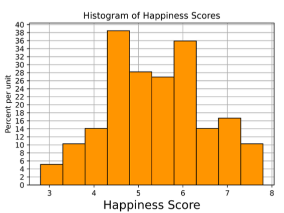

#### D8 Prof Sanchez 
# Midterm Review 
#### Sean Villegas

[Worksheet](https://drive.google.com/file/d/1KSOC_Df4GgdeXTYetq8pUj2_JInCOIrV/view)

<style>
    .tnr {
        font-family: "Times New Roman";
        font-size: 15px;
    }

</style>
## Tables
 
| Name | Type | HP | Speed | Generation | Legendary |
| --- | --- | --- | --- |  --- |  --- | 
| Bulbasaur | Grass | 45 | 45 | 1 | False |
| Charmander | Fire | 39 | 65 |1 | False |
| Squirtle | Water | 44 | 43 | 1 | False |
| Palkia | Water/Dragon | 90 | 100 | 4 | True |
| Dialga | Steel/Dragon | 100 | 90 | 4 | True |
| Giratina | Ghost/Dragon | 150 | 90 | 4 | True |

#
 
<div class='tnr'>

a. Find the name of the pokemon of only type `Water` that has the highest HP.

</div>

```python
water_pokemon = pokemon._____(_____, _____)
water_pokemon._____(_____, _____).column("Name").item(0)


water_pokemon = pokemon.where('Type', are.equal_to('Water'))
water_pokemon.sort('HP', descending=True).column("Name").item(0)
```

**Moral:**
- Make sure to sort `descending=True` because `.sort` method defaults to ascending sort

#

<div class='tnr'>

b. Find the proportion of Fire-type Pokemon with a **Speed** less than 100.
</div>

```python
fire_pokemon = pokemon._____(_____, _____)
fire_pokemon.where(_____, _____)._____ / _____._____

# first attempt
fire_pokemon = pokemon.where('Type', 'Fire')
fire_pokemon.where('Speed', are.below(100)).num_rows / pokemon.num_rows

# answer
fire_pokemon = pokemon.where('Type', 'Fire')
fire_pokemon.where('Speed', are.below(100)).num_rows / fire_pokemon.num_rows
```

**Moral:**
- You divide by proportion of 'fire' type pokemon population, not the whole population count 

#
<div class='tnr'>

c. Create a table containing Type and Generation that is sorted in decreasing order by the average HP for each pair of Type and Generation that appears in the table
</div>

```python

avg_hp = pokemon._____(_____, _____)
avg_hp.sort("HP mean", _____)._____(_____, _____)

# first attempt, WIW .where needs a predicate
avg_hp = pokemon.group(make_array('Type', 'Generation'), np.mean)
avg_hp.sort("HP mean", descending=True).where('Type', 'Generation')'

# solution
avg_hp = pokemon.group(make_array('Type', 'Generation'), np.mean)
avg_hp.sort("HP mean", descending=True).select('Type', 'Generation')
```

**Moral:**
- Use `.select` method instead of where when you want a table based on certain columns, where is for predication 

#

<div class='tnr'>

d. Return an array that contains ratios of legendary to non-legendary pokemons for each generation. You may assume that the Legendary column is a column of booleans.
</div>

```python
leg_per_gen = pokemon._____(_____, _____)
ratios = leg_per_gen._____(_____) / leg_per_gen._____(_____)

leg_per_gen = pokemon.pivot('Generation', 'Legendary')
ratios = leg_per_gen.column('True') / leg_per_gen.column('False')
```

**Moral:**
- Each unique value in col1 has its own column
- Each unique value has its own row
- Default is `collect=count`
- The table now looks like: 

**First attempt:**
| 1 | 2 | 3 | 4 | True | False
| --- | --- | --- | --- | --- | ---|
| True | True | False | True | 3 | 1 | 

**Solution:**

| Generation | True | False | 
| --- | --- | --- | 
| 1 | 0 | 3| 
| 2 | 2 | 4|
| 4 | 3| 0 |

#

<div class='tnr'>
e. Consider another table called trainers, which contains information about Pokemon trainers and the Pokemon they own. The trainers table has two columns: Trainer, the name of the trainer and Pokemon, the name of the Pokemon. Use table operations to create a new table called pokemon with trainers that includes each Pokemon’s Name, Type, Generation, and their Trainer.
</div>


```python
trainers_added = pokemon._____(_____)
pokemon_with_trainers = trainers_added._____

# attempt 1
trainers_added = pokemon.join('Name', 'Trainer', 'Pokemon')
pokemon_with_trainers = trainers_added.with_column(trainers_added).drop('Pokemon', 'HP', 'Speed', 'Legendary')

# solution
trainers_added = pokemon.join('Name', trainers, 'Pokemon')
pokemon_with_trainers = trainers_added.drop('HP', 'Speed', 'Legendary')
```

**Moral:**
- We dont need to drop `'Pokemon'` because its not duplicated but instead provided for the `.join` method
- `col1` passed in is a check for `col2` to join where all values appear in both tables 

#

## Histograms

<div class='tnr'>
The World Happiness Report is a landmark study on the state of global happiness. This study calculated and ranked the happiness level for 155 countries using data from the Gallup World Poll. The histogram below shows the distribution of happiness scores computed from this study in 2019. Suppose the data is stored in the table called happiness. The following code was used to generate the histogram you see below:

</div>

```python
happiness.hist("Score", bins = np.arange(2.8, 8, 0.5))
```



<div class='tnr'>
a. What are the units of the y-axis in the histogram?
</div>

- The units of the y axis are in in percent per Happiness score

**Moral:** 
- When interpreting histograms: 
    - read the y label and x label and write sentence of the relationship 
#

<div class='tnr'>
For part b - e, use the above histogram to calculate the following quantities. If it’s not possible, write ”Cannot
calculate” and explain your reasoning.

<br>
b. The proportion of countries with happiness scores between 4.3 and 5.8.
</div>

<details><summary>How to Interpret Histograms, and the math behind this questions</summary>
<br>
Each bin is represented in mathematical notation as `[start, stop)` to indicate that we only include the start through to the second to last value of stop. 

- `bins = np.arange(2.8, 8, 0.5)` tells us: 
    - we start at `2.8 `
    - we end at `8`
    - we increment by `0.5`

<br>
1. First calculate the intervals that we need to get their heights from

$$
{4.3 + 0.5 = 4.8 \rightarrow 4.8+0.5 = 5.3 \rightarrow 5.3+0.5 \rightarrow STOP}
$$

**Our intervals starting and only accounting for the left start height for each interval is:** 

$${[4.3, 4.8) + [4.8, 5.3) + [5.3, 5.8) \equiv 39 + 28 + 27}$$

2. We have our heights, simply add to get 93

3. Then we employ the Area formula $\text{width * height}$

$${0.5 \cdot 93 = 46.5 \lor 0.465 \equiv  \text{width of bin} \cdot \text{height of bin}}$$

**Moral:**
- $\text{Area formula = width * height}$
- `bins = np.arange(start, stop, width)`
</details>

# 
<div class='tnr'>
c. The number of countries with happiness scores between 4.3 and 5.8 (round to the nearest country).
</div>

We have the computed the area for the interval [4.3, 5.8); which is 4.65. Now we multiply that by the total number of countries to find the number of countries.

$${.465 \cdot 155 \approx 72 \text{ Countries}}$$

**Moral:**
- we want to multiply the proportion we calculated by the total number represented in the histogram
#

<div class='tnr'>
d. The number of countries with happiness scores between 6 and 7.
</div>
<br>

- Not possible to calculate because our bins do not include 6 and 7 as their starting range, but rather they are within their intervals starting from 2.8 with a width of 0.5 

**Solution:**
- Not possible; we don’t have bins that exactly comprise [6, 7), and we do not know the distribution of countries
within bins

#

<div class='tnr'>
e. The height of the new bin after combining the three leftmost bins.
</div>
<br>

Here we are asked to calculate the height of the the three leftmost bins

<details><summary>Finding Height</summary>

1. Get the three leftmost bins areas combined 

${[2.8, 3.3) + [3.3, 3.8) + [3.8, 4.8)} \equiv 5 + 10 + 14 = 29 \implies \text{ 29 as new height}$

2. Finish calculating the area: ${29 \cdot 0.5 = 14.5}$
3. Add the widths of the 3 bins ${0.5 \cdot 3} = 1.5$
4. Now we divide the new area times the new width: ${14.5 / 1.5 \approx 9.67\% \text{per unit}}$

**Moral:**
- You're trying to find a uniform height for a single combined bin that, so you rearrange our Area formula to be: 

$$Area = {H \cdot W} \rightarrow Height = {\displaystyle\frac{Area}{Width}}$$
</details>

## Probability

<div class='tnr'>
a. A fair coin is tossed five times. Two possible sequences of results are HTHTH and HTHHH. Which sequence of results is more likely? Explain your answer and calculate the probability of each sequence appearing.
</div>
<br>

**My answer:**
- The alternative, HTHHH is more likely because probability distributions look biased when we have a smaller sample size

**Solution:**
- Both heads and tails have a probability of .50, meaning that they are equally likely. The probability of each sequence appearing is $(\displaystyle\frac{1}{2})^{5}$
# 
<div class='tnr'>

For parts b - e, assume we have a biased coin such that the probability of getting heads is $\displaystyle\frac{1}{5}$ and the probability of getting tails is $\displaystyle\frac{4}{5}$. The coin is tossed 3 times. What is the probability that you get exactly 2 heads?

</div>
<br>

With our new probabilities, employ the multiplication rule and addition rule 

- _where **and** is multiplication_ $\implies \land $
- _where **or** is addition_

If our coin was tossed 3 times, that would be:

**Original answer:**
$$(\displaystyle\frac{4}{5} + \displaystyle\frac{1}{5})^3$$

**Solution:**
- First, we understand that our desired outcome is 2 heads out of 3 coin flips. So our desired probability is $(\displaystyle\frac{1}{5})^2$ for heads
- We only want one tail, so that probability is $\displaystyle\frac{4}{5}$
- Now we multiply that probability by 3
$${3 \cdot (\displaystyle\frac{1}{5})^2 \cdot \displaystyle\frac{4}{5}}$$

# 

<div class='tnr'>
c. Once again, we toss the same biased coin 3 times. What is the probability you get no heads?
</div>

- This probability is when we have no heads, no need for compliment rule. Just 3 flips of desired probability 

$${(\displaystyle\frac{4}{5})^3}$$
#

<div class='tnr'>
d. Once again, we toss the same biased coin 3 times. What is the probability you get 1 or more heads?
</div>

- This is the compliment rule, meaning we subtract 1 by our desired outcome 
$$1 - (\displaystyle\frac{4}{5})^3$$

- **Note:** we subtract the _computed_ probability from 1 (not other way around)

**Moral:**
- The complement of getting at least 1 head is getting no heads, which
we’ve just calculated in the previous question.
- Compliment rule: $P(A) = 1 - P(\text{not A})$

#

<div class='tnr'>

e. What is the probability of getting exactly 1 head or exactly 2 heads?

_working with same probabilities for 3 coin tosses_
</div>

$$3 \cdot (\displaystyle\frac{1}{5}) \cdot \displaystyle\frac{4}{5} + 3 \cdot (\displaystyle\frac{1}{5})^2 \cdot \displaystyle\frac{4}{5}$$

$$\equiv$$

$$\text{Probability A} \lor \text{Probability B}$$

#

## Simulation and Hypothesis Testing

<div class='tnr'>

A tortoise and a hare want to have a race on a number line! They both start at 0 and the race lasts for 100 time steps. However, they move differently. At each time step the tortoise moves 1 step forward with a $\displaystyle\frac{1}{2}$ chance (and stays in place with a $\displaystyle\frac{1}{2}$ chance), and the hare moves 3 steps forward with a $\displaystyle\frac{1}{6}$ chance.

They race, and the tortoise loses badly; the hare finished 50 steps ahead of the tortoise. Suspicious, the tortoise decides to conduct a hypothesis test to determine whether or not the hare is actually faster.

#

a. Fill in the blanks below for the null and alternative hypotheses of this test, as well as a valid test statistic.
</div>

Null Hypothesis:
- The hare and the tortoise move at similar speeds and any variation is due to chance

**Answer:**
- The hare is not faster than the tortoise. The hare finishing 50 steps ahead of the tortoise was simply due to random chance.

Alternative Hypothesis:
- The hare and the tortoise do not move at similar speeds and variations are not due to chance

**Answer:**
- The hare is faster than the tortoise. The hare finishing 50 steps ahead of the tortoise was not due to random chance.

Test Statistic:
- We will simulate with our given data

**Answer:**
- The difference in distances between the hare and the tortoise at the end of each race.


#
<div class='tnr'>

b. Write a function called one race() that simulates a single race of 100 time steps. It should return a two element array of the final distances of both the tortoise and the hare (in that order) from the origin after 100
time steps.
</div>

```python
# skeleton
def one_race():
    tortoise_array = ________
    hare_array = ________
    tortoise_sim = ________
    hare_sim = ________
    tortoise_distance = ________
    hare_distance = ________
    return make_array(tortoise distance, hare distance)

# attempt 
def one_race():
    tortoise_array = make_array(1/2, 1/2)
    hare_array = make_array(1/6, 5/6)
    tortoise_sim = sample_proportions(100, tortoise_array)
    hare_sim = sample_proportions(100, hare_array)
    tortoise_distance = 100 - tortoise_sim
    hare_distance = 100 - hare_sim
    return make_array(tortoise_distance, hare_distance)

# solution 
def one_race():
    tortoise_array = make_array(1/2, 1/2)
    hare_array = make_array(1/6, 5/6)
    tortoise_sim = sample_proportions(100, tortoise_array)
    hare_sim = sample_proportions(100, hare_array)
    tortoise_distance = tortoise_sim.item(0) * 100
    hare_distance = hare_sim.item(0) * 300 
    return make_array(tortoise_distance, hare_distance)
```

**Moral:**
- `.item(0)` grabs the first item in the array, which corresponds to the proportion of the tortoise or hare moving forward. The 1-nth index is the probability they did not move forward 
- Since there are 100 time steps, multiplying the proportion of "step-forward" outcomes by 100 gives the total number of steps forward the tortoise took
    - similarly for the Hare, multiplying 3 * 100 gives us 300 to represent 3 steps forward, times the percentage to get a standard unit of steps moved forward. 

#

<div class='tnr'>
c. We would now like to simulate what would happen if the tortoise and the hare races 10,000 times. Complete the code below and record how far the tortoise and the hare end from the origin in the arrays tortoise distances and hare distances respectively.

</div>

```python
tortoise_distances = make_array()
hare_distances = make_array()
for ________:
    race = ________
    one tortoise dist = ________ 
    one hare dist = ________
    tortoise distances = ________
    hare distances = ________

# attempt 
tortoise_distances = make_array()
hare_distances = make_array()
for i in np.arange(10000):
    race = one_race()
    one_tortoise_dist = race.item(0) 
    one_hare_dist = race.item(1)
    tortoise_distances = np.append(tortoise_distances, one_tortoise_dist)
    hare_distances = np.append(hare_distances, one_hare_dist)
```

# 

<div class='tnr'>

d. After 10,000 simulations of the race, we have recorded the distances in the `results` table which contains
the following two columns:
- Competitor (string): the name of the competitor, either “tortoise” or “hare”
- Distance (int): the final distance of the competitor at the end of the race
The table has 20,000 rows in total — 10,000 for the tortoise and 10,000 for the hare. Using the results table, create an overlaid histogram that shows the distribution of final distances for both the tortoise and the hare.
</div>

```python
________.________( ________, group = ________)

# attempt 1 
results.hist('Competitor', group = 'Distances')

# solution 
results.hist('Distances', group = 'Competitor')

```

**Moral:**
- **A histogram** is used to display the distribution of _numerical data_ (in this case, the Distance column), not _categorical data_ like the Competitor column.
- Always _use_ and display numerical data in a histogram, and **group** by categorical data for an overlaid histogram 

#

<div class='tnr'>
e. Create an array called differences where each value in the array represents how many steps the hare finished ahead of the tortoise in a given race. Then, write a line of code to calculate the observed p-value of the hypothesis test. Finally, assuming a 5% p-value cutoff, describe the different conclusions you would come to based on the possible values of the observed p-value.
</div>


```python
differences = ________
p_value = ________

# attempt 1
differences = results.select('Competitor', 'Distances').where('Competitor', are.equal_to('hare')) - results.select('Competitor', 'Distances').where('Competitor', are.equal_to('tortoise'))
p_value = np.count_nonzero(differences <= 0.05)

# making attempt work

differences = results.where('Competitor', are.equal_to('hare')).column(1) - results.where('Competitor', are.equal_to('tortoise')).column(1)
p_value = np.count_nonzero(differences >= 50) / 10000 

# solution 
differences = hare_distances - tortoise_differences 
p_value = np.count_nonzero(differences >= 50) / 10000 
```

- If the observed value is less than the 5% cutoff, then fail to reject the null and reject the alternative. Meaning that the differences in steps between Hare and Tortoise for a 100 step race is fair and any variation is due to chance. 

**Moral:**
- the simulated differences are already appending and in the global frame, no need to call table methods to extract them again when we can just subtract the array data types we have
- **When calculating the observed p-value in a one-sided hypothesis test**, use this formula:
    ```python
    p_val = np.count_nonzero(simulated_differences >= observed_difference) / num_simulations
    ```
    - simulated_differences is the array of differences from your simulations.
    - observed_difference is the actual difference you saw in the real race (e.g., 50)
    - num_simulations is the total number of trials you ran (e.g., 10,000)

#

## True/False

<details><summary>Approaching these types of problems</summary>
<br>

#

### Is this comparison fair? $\implies$ Rates and Raw Totals, Accounting Contextual Variables

Steps: 
1. Spot a comparison:
    - Are they comparing across time, groups, or categories?
2. Ask what the numbers represent:
    - Is it a raw count (e.g., total deaths)?
    - Or a rate (e.g., deaths per 100,000 people)?
3. Ask: what might be changing in the background?
    - Population size?
    - Age distribution?
    - Measurement method?
4. Decide if the conclusion is justified:
    - Does it ignore an obvious confounder (like population growth)?
    - Is it mistaking correlation for causation?

#

### the concept of statistical inference vs. population data.

- **A/B test** is a tool of inference, used when you have a sample and want to make generalizations about a larger population
- If you have the entire population, there's nothing to infer — you can just compute the actual difference directly.

</details>
<br>
<div class='tnr'>

1. In the U.S. in 2000, there were 2.4 million deaths from all causes, compared to 1.9 million in 1970, which represents a 25% increase. The data shows that the public’s health got worse over the period 1970-2000.
</div>

This statement is false, correlation does not imply causation, and this study does not account for the increase in population

**Textbook answer for evaluating trends in public health:**
- Recommends a rate-based comparison (e.g., deaths per capita), which is statistically appropriate when comparing across time.
    - False; the increase in total deaths does not necessarily mean public health declined. The population also increased between 1970 and 2000, so it would be more meaningful to compare death rates (e.g., deaths per 1,000 people), not raw counts.

<div class='tnr'>

2. A company is interested in knowing whether women are paid less than men in their organization. They share all their salary data with you. An A/B test is the best way to examine the hypothesis that all employees in the company are paid equally.
</div>

False, if you have all the data, you can simply compare it via table methods. 
    
**Textbook answer:**
- False, there is no room for statistical inference here. We have access to the whole population, so the answer can simply be retrieved by directly looking at the data. There is no need for an A/B test here.

<div class='tnr'>

3. Consider a randomized controlled trial where participants are randomly split into treatment and control groups. We are 100% certain there will be no systematic differences between the treatment and control groups if the process is followed correctly.
</div>

False, even if we follow the random splits correctly, we are not accounting for outside variables that could effect the purity of our sample size. I would need to know things about the people we are splitting randomly before doing so. 

**Moral:**
- Randomization minimizes expected bias, but it does not eliminate the possibility of imbalance between groups — especially in smaller samples. Chance alone can create systematic differences.
- Statistical term you want: **systematic difference**
    -  an imbalance between groups that affects outcomes.
- You don’t need prior knowledge about participants for randomization to work. It’s designed to balance both known and unknown factors on average, but not in every individual trial.

<div class='tnr'>

4. A researcher considers the following scheme for splitting people into control and treatment groups. People are arranged in a line and for each person, a fair, six-sided die is rolled. If the die comes up to be a 1 or a
2, the person is allocated to the treatment group. If the die comes up to be a 3, 4, 5, or 6 then the person is allocated to the control group. This is a randomized control experiment.

</div>
<br>

True, the chances of splitting people into control or treatment groups is based on the die-rolls probability alone. 

**Moral:**
- A randomized control trial requires that participants are assigned to groups based on random chance, with known probabilities.
- The assignment doesn’t need to be 50/50 — unequal probabilities (like 2/6 vs. 4/6) are still valid for RCTs.
    - However, unequal group sizes can affect the precision and power of your statistical comparisons. So they should be planned for accordingly

<div class='tnr'>

5. You are conducting a hypothesis test to check whether a coin is fair. After you calculate your observed test statistic, you see that its p-value is below the 5% cutoff. At this point, you can claim with certainty that the null hypothesis can not be true.
</div>

False, if you were looking at a graph, and the probability value is less than the 5% cut off, then we can assume that the null is true. The hypothesis is only in favor of the alternative when the p value is above the 5% cut off line. 

**Moral:**
- P-value: A p-value expresses the probability, under the null Hypothesis,
that you observe a value for your test statistic that is at least as extreme as your observed test statistic in the direction of the alternative. 
    - A p-value expresses the probability, assuming the null hypothesis is true, of observing a test statistic at least as extreme as the observed one, in the direction of the alternative.
- Small p-value (< 0.05) $\rightarrow$ evidence against the null
- Large p-value (> 0.05) $\rightarrow$ not enough evidence to reject the null.
- Null hypothesis cannot be proven false.

<details><summary>More for anki</summary>

- Misunderstanding about empirical distributions and critical value 
    - if the empirical distribution falls beyond the cutoff (in the tail), we reject the null hypothesis and support the alternative hypothesis.

Empirical Distribution: 
- The empirical histogram (which is based on observed frequencies) is what you actually observe as you roll the die or some experiment 

Z-score: 
- A z-score is a measure of how many standard deviations an observed value is from the mean of a distribution.

Critical Value: 
- The critical value is a threshold used in hypothesis testing to determine whether you should reject the null hypothesis. It is a value from the sampling distribution that corresponds to a specific probability level (usually based on a significance level like 0.05).
</details>
<br>
<div class='tnr'>

6. You roll a fair die a large number of times. While you are doing that, you observe the frequencies with which each face appears and you make the following statement: As I increase the number of times I roll the die, the probability histogram of the observed frequencies converges to the empirical histogram.
</div>

False, as you increase the number of times you roll the die, by law of averages the empirical histogram will converge based on probability 

**Answer:**

False, the statement should be: As I increase the number of times I roll the die, the empirical histogram of
the observed frequencies converges to the probability histogram of a fair die.

- The **probability histogram** represents the expected frequencies of the die faces, based on the theoretical probability.

**Moral:**
- As the number of trials (like rolling the die) increases, the empirical results (what you observe) will tend to converge to the true probabilities (theoretical probabilities).
    - This is a consequence of the law of large numbers.
- The law of large numbers states that as the sample size increases, the sample mean (or the observed frequency) gets closer and closer to the expected value (the theoretical probability of each die face).


#

## Functions

<div class='tnr'>

Simone loves completing the NYT Monday crossword puzzle, and is interested in seeing how fast she completes it in comparison with her friends. Over the past two months, Simone and her friend Joanna have been recording their crossword completion times (in seconds) in the arrays `simone_times` and `joanna_times`
respectively. Simone decides to put her skills to the test by randomly selecting one of her times and comparing it to a randomly chosen time of Joanna’s.
#
a. Write a function called one comparison that randomly chooses one time from `simone_times` and one time from `joanna_times`, and returns True if Simone’s time was better than Joanna’s.
</div>

```python
def one_comparison():
    return _____

# attempt
def one_comparison():
    return bool(np.random.choice(simone_times < joanna_times))

# works
def one_comparison():
    return bool(np.random.choice(simone_times) < np.random.choice(joanna_times))

# solution
def one_comparison():
    return np.random.choice(simone_times) < np.random.choice(joanna_times)
```

**Key Takeaway:** 
- The comparison `<` returns a boolean (True or False).
    - Wrapping it in `bool(...)` is technically redundant, because the comparison already returns a boolean.
- `np.random.choice(arr)` 
    - Takes a single array as parameter and returns a randomly selected element from it.
- If you're ever unsure whether something returns a boolean
    - `type(5 < 8)`


#

<div class='tnr'>
b. Now, write a function called crossword comparison that takes in trials, which is the number of times we randomly compare one of Simone’s completion times with one of Joanna’s. The function should print a statement explaining the total number of times Simone won. For example, if Simone won 6 times out of 10 trials, the statement should read “Simone beat Joanna 6 times out of 10 trials”
</div>

```python
def crossword_comparison(trials):
    wins = _____
    for i in _____:
        if _____:
            wins = _____
    print("Simone beat Joanna " _____ " times out of " _____ " trials")

    # first attempt # also works 
def crossword_comparison(trials):
    wins = make_array()
    for i in np.arange(trials):
        if one_comparison():
            wins = np.append(wins, 1)
    print("Simone beat Joanna " + str(len(wins)) + " times out of " + str(trials) + " trials")

    # second attempt (based on memory) # got solution correct
def crossword_comparison(trials):
    wins = 0
    for i in np.arange(trials):
        if one_comparison():
            wins = wins + 1
    print("Simone beat Joanna " + str(wins) + " times out of " + str(trials) + " trials")
```
#

<div class='tnr'>
c. Simone is interested in using her new function to show Joanna that she is superior in crossword solving. She runs crossword comparison over 100 trials, and assigns the output to a variable called my_wins for easy
access. What is one issue with this process?
</div>

- The issue is that we dont return the solution at all, and it is lost at each iteration of the trial.
- Additionally, print returns none after computation, so we if we assigned it to a array called my_wins it would be `None` which is falsy value 

#

<div class='tnr'>
d. Finally, Simone wants to create a team of Data 8 course staff for competitive crossword-puzzle solving.
However, she is particular and will only accept them if they satisfy the following two conditions:

1. She wants to create a very strong team, so she only wants to recruit people who have an average crossword completion time below 5 minutes
2. Her favorite number is 10, so of the people above she will only recruit those who have a last name that is exactly 10 letters long

- Write a function that takes in a table with three columns:
    - First (str): Player’s first name
    -  Last (str): Player’s last name
    -  Time (int): Player’s completion time for that puzzle in seconds

and returns an array of player names (First and Last) that Simone will recruit for her team. If Bing Concepcion is supposed to be in the array, you may leave his name as “BingConcepcion”.

</div>

```python
def create_team(players):
    player_means = _____
    with_lengths = _____
    chosen_players = _____
    return _____ 

# attempt 

def create_team(players):
    player_means = players.apply(np.mean, 'Time') # need to pass in variables, Distance already computed
    with_lengths = players.where('Last', are.equal_to(len(10))) # doesn't work
    chosen_players = with_lengths.with_columns('Avg', player_means).where('Time', are.below(280)) # five minutes 60+60+60+60+60 = 280  # wrong time
    return chosen_players.select('First', 'Last').column(0) + chosen_players.select('First', 'Last').column(1) # works but redundant 

# solution
def create_team(players):
    player_means = players.group(make_array('First', 'Last'), np.mean)
    with_lengths = player_means.with_columns('Length', players.apply(len, 'Last'))
    chosen_players = with_lengths.where('Time mean', are.below(300)).where('Length', are.equal_to(10))
    return chosen_players.column('First') +  chosen_players.column('Last')
```

**Moral:**
- `.apply(len, 'Last')` to get string lengths.
- `group()` aggregates only numerical columns not used in the grouping.


# 

## More hypothesis Testing

<div class='tnr'>
Chloe is a big fan of Trader Joe’s Frozen Mac ‘n Cheese, but she noticed that the cheese used in it varies from box to box. A Trader Joe’s employee provides her with some data about the 4 different cheeses used and the probability of them being used in each box:
</div>

<center>

| Cheese | Probability | 
| --- | --- | 
| Velveeta | 0.05 |
| Gruyere | 0.55 | 
| Sharp Cheddar | 0.55 | 
| Monterey Jack | 0.25 | 

</center>

<div class='tnr'>
Chloe is suspicious about this distribution. After all, Velveeta is much cheaper to use than Gruyere, and she has also never bought a box that uses Gruyere. Chloe decides to buy many boxes throughout the next month and tracks the type of cheese used in each box. She uses this to conduct a hypothesis test.

<br>

a. Write a valid null and alternative hypothesis for this experiment.

Null Hypothesis:
- The probability of cheeses distributions given per 4 cheeses per box are normal and any variation is due to chance

Alternative Hypothesis:
- The probability of cheeses distributions given per 4 cheeses per box are not due to just chance 
    - **Answer Key:**
        - The types of cheese in the Frozen Mac ‘n Cheese boxes are not distributed according to the probability distribution provided by the employee. Any observed difference is not just due to chance.
</div>

```python
observed_proportions = make_array(0.2, 0.3, 0.45, 0.05)
employee_proportions = make_array(0.05, 0.55, 0.25, 0.15)
```

<div class='tnr'>
The array observed proportions contains the proportions of cheese that Chloe observed in 20 boxes of Mac n Cheese.

<br>

b. Chloe wants to use the mean as a test statistic, but Katherine suggests that Chloe use the TVD (total variation distance) instead. Which test statistic should Chloe use in this case? Briefly justify your answer. Then,
write a line of code to assign the observed value of the test statistic to observed stat.

Katherine is correct. The total variation distance is used to measure the difference between the two probability distributions. 
</div>

```python
observed_stat = ______

# attempt
observed_stat = sum(abs(observed_proportions - employee_proportions)) / 2


# use np.abs # solution
observed_stat = sum(np.abs(observed_proportions - employee_proportions)) / 2
```

<div class='tnr'>

c. Define the function `one_simulated_test_stat` to simulate a random sample according to the null hypothesis and return the test statistic for that sample.
</div>

```python
def one_simulated_test_stat():
    sample_prop = sample_proportions(1, employee_proportions) # test stat
    return np.count_nonzero(obs >= given ) / 1 
    
    # solution 

def one_simulated_test_stat():
    sample_prop = sample_proportions(20, employee_proportions) # given 20 boxes as count 
    return np.sum(np.abs(observed_stat - sample_prop)) / 2  # np.sum because we are working with arrays 

```

**Moral:**
- Use TVD when comparing categorical distributions.
- TVD helps detect overall differences, not just differences in one value like the mean.
- Always compare your observed distribution to your null hypothesis distribution to quantify how "surprising" your result is.
- When simulated under the null, you take the TVD again of your observed proportions and the given proportions to that sample size under null as many times with simulated data
- **You compute TVD once per comparison — and do this:**
    - Once for the observed test statistic (i.e., how far the actual data is from the null distribution).
    - Many times for simulated test statistics (to build the null distribution of what TVDs would look like by chance).

#

<div class='tnr'>
d. Chloe simulates the test statistic 10,000 times and stores the results in an array called simulated stats. The observed value of the test statistic is stored in observed_stat. Complete the code below so that it evaluates to the p-value of the test:
</div>

```python
____________(simulated_stats _____ observed_statistic) / ____________

# got correct 
np.count_nonzero(simulated_stats >= observed_statistic) / 10000
```

# 

<div class='tnr'>

- e. Given that the computed p-value is 0.0825, which of the following are true? Select all that may apply.
    -  Using an 8% p-value cutoff, the null hypothesis should be rejected.
    -  Using a 10% p-value cutoff, the null hypothesis should be rejected.
    - There is an 8.25% chance that the null hypothesis is true.
    - There is an 8.25% chance that the alternative hypothesis is true
</div>

The only option that is true is: 
- Using a 10% p-value cutoff, the null hypothesis should be rejected.

**Why?**
- Because 10% is the only time that we can reject the probability value of 0.0825. 
- The other options that talk about chance are not applicable because our p-value is not a chance, it is a simulated value that we draw a conclusion on when to reject or accept the null.

**Moral:**
- The p-value does not represent the probability that the null hypothesis is true. 
    - Instead, the p-value is the probability of observing the data (or something more extreme) assuming the null hypothesis is true. It is not a direct measure of the probability of the null hypothesis being true.
- **P-value represents the probability of obtaining the observed data, or more extreme data, assuming the null hypothesis is true.**
- **Rejection rule:**
    - If the p-value is less than or equal to the significance level (α), reject the null hypothesis.
    - If the p-value is greater than the significance level, fail to reject the null hypothesis.
- $\alpha \implies \text{Significance Level } \lor \text{Cut-off Level}$
#

## A/B Testing

<div class='tnr'>

a. A/B testing is used to determine whether or not we believe two samples come from the same underlying distribution
</div>

**True** because A/B Testing is a statistical method used to compare two groups to determine if there is a significant difference between them, helping us decide if they come from the same underlying distribution.

#
<div class='tnr'>
b. To conduct a permutation test, you should sample your data with replacement with a sample size equal to the number of rows in the original table.
</div>

<br>

**False**, you sample without replacement to not capture the same variation
- In a permutation test, we shuffle the labels or outcomes without replacement to simulate the null hypothesis — that the group labels do not matter and any observed difference is due to chance.
- Sampling with replacement would be bootstrapping, which is used to estimate the variability of a statistic, **not for hypothesis testing under the null.**
#
<div class='tnr'>
c. A/B testing is the same as using total variation distance as a test statistic for a hypothesis test
</div>

False, different testing methods
#

<div class='tnr'>
Kevin, a museum curator, has recently been given specimens of caddisflies collected from various parts of Northern California. The scientists who collected the caddisflies think that caddisflies collected at higher altitudes tend to be bigger. They tell him that the average length of the 560 caddisflies collected at high elevation is 14mm, while the average length of the 450 caddisflies collected from a slightly lower elevation is 12mm. He is not sure that this difference really matters and thinks that this could just be the result of chance in sampling.

#
a. What is an appropriate null hypothesis that Kevin can simulate under? 
</div>
<br>
Kevin can simulate under the null average length of a caddisflies at higher or lower altitude are normal and any variation is due to chance

**Answer:**
- The distribution of specimen lengths is the same for caddisflies sampled from high elevation as those sampled from low elevation. Any observed difference between the two samples is simply due to
random chance.
#
<div class='tnr'>
b. How could you test the null hypothesis in the A/B test from above? What assumption would you make to test the hypothesis, and how would you simulate under that assumption?

</div>

<br>
To do a A/B test for the above we would have us compare the two groups (high elevation v.s. low elevation) caddisflies and find if there is a significant difference, to which we would reject the null if there was. 

<br>

**Answer:**
- If the null hypothesis is true – the caddisflies did not come from different distributions – then it should not matter how the samples were labeled (high elevation or low elevation). Under this assumption, you could shuffle the labels of the caddisflies and calculate your test statistic from this “relabeled” data.

**Moral:**
- Assume the categorical labels (like high vs. low elevation) don’t matter under the null.
- Shuffle the labels without replacement, recompute the test statistic (like difference in means), and compare your observed statistic to this simulated distribution.

#
<div class='tnr'>
c. What would be a useful test statistic for the A/B test? Remember that the direction of your test statistic should come from the initial setting.
</div>

A useful test statistic for our A/B test would be either order, just recall that it can effect the direction of our alternative hypothesis because its not in absolute value

**Moral:**
- Use the difference in average lengths (e.g., high – low).
- Direction matters: 
    - the sign tells you if high elevation flies are longer or shorter **so don’t use absolute value unless doing a two-sided test.**

#

<div class='tnr'>

<center>

| Elevation | Specimen Length | 
| --- | --- | 
| High Elevation | 12.3 |
| Low Elevation | 13.1 | 
| High Elevation |12.0 | 

... 1007 rows omitted

</center>

Fill in the blanks in this code to generate one value of the test statistic simulated under the null hypothesis.

</div>

```python
def one_simulation():
    shuffled_labels = flies._______.column(_______)
    shuffled_flies = flies.with_columns(_______, _______)
    grouped = shuffled_flies._______(_______, _______)
    means = grouped.column(‘Specimen length mean’)
    statistic = _______
    return statistic 

# attempt 1 
def one_simulation():
    shuffled_labels = flies.sample().column('Elevation')
    shuffled_flies = flies.with_columns('Shuffled', shuffled_labels)
    grouped = shuffled_flies.group('Elevation', collect=np.mean)
    means = grouped.column('Specimen length mean')
    statistic =
    return statistic 

# solution
def one_simulation():
    shuffled_labels = flies.sample(with_replacement=False).column('Elevation')
    shuffled_flies = flies.with_columns('Elevation', shuffled_labels)
    grouped = shuffled_flies.group('Elevation', collect=np.mean)
    means = grouped.column('Specimen length mean')
    statistic = means.item(0) - means.item(1)
    return statistic 
```

#

<div class='tnr'>
e. Fill in the code below to simulate 10000 trials of our permutation test.
</div>

```python
test_stats = _______
repetitions = _______
for i in np.arange(_______):
    one_stat = _______
    test_stats = np.append(test_stats, one_stat)
test_stats

# got correct 

test_stats = make_array() 
repetitions = 10000
for i in np.arange(repetitions):
    one_stat = one_simulation()
    test_stats = np.append(test_stats, one_stat)
test_stats
```
#

<div class='tnr'>
f. The histogram of test stats is plotted below with a vertical red line indicating the observed value of our test statistic. If the p-value cutoff we use is 5%, what is the conclusion of our test?


</div>

We conclude that we reject the null hypothesis since our right end of our histogram is larger than our p value cut off

#

<div class='tnr'>
g. Suppose that the null hypothesis is true. If we ran this same hypothesis test 1000 times, each time from our
flies table and with a p-value cutoff of 5%, how many times would we expect to incorrectly reject the null
hypothesis?
</div>
<br>

We would expect to reject the null hypothesis a total of 50 times. The process for doing this is $1000 \cdot 0.05 \equiv \text{Simulated Count} \cdot \text{P-Value Cut off}$
#

<div class='tnr'>
h. What effect does decreasing our p-value cutoff have on the number of times we expect to incorrectly reject the null hypothesis?
</div>
<br>

Decreasing our p-value cutoff will effect the number of times we expect to reject the null hypothesis by our Type 1 error being lower. 